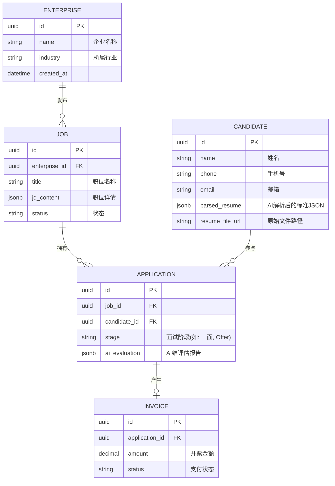

# YZSCHROS 猎头公司管理智能系统 - 项目介绍书

## 一、项目概述

### 1.1 项目名称与核心定位
**项目名称**：YZSCHROS (猎头公司管理智能系统 - 业务增强型智能猎头操作系统)
**核心定位**：专为猎头公司与高端招聘机构打造的下一代智能化、数据化、自动化的业务操作系统。系统深度融合了Node.js原生“Fast-Hybrid”极速解析引擎与本地化大语言模型（LLM），在传统ATS（申请追踪系统）的基础上，提供极致的简历解析性能与高精度的“人岗匹配”能力。

### 1.2 开发背景
传统的猎头系统面临诸多痛点：
1. **简历解析慢且极不稳定**：重度依赖庞杂的Python/YOLO/OCR架构，导致高并发场景下频发超时与系统崩溃。
2. **匹配效率低下**：缺乏语义级别的理解，仅仅依赖关键词检索，导致精准度受限，顾问需要大量手工筛选。
3. **UI/UX体验陈旧**：多数B端系统界面复杂臃肿、响应迟缓，无法提供类似高端SaaS的流畅协作体验。
YZSCHROS 旨在通过全栈重构（Next.js 16 + NestJS 11）与AI深度赋能，彻底革新猎头工作流。

### 1.3 应用场景与目标用户群体
- **应用场景**：高端人才库搭建与沉淀、全渠道简历极速入库与结构化、智能JD（职位描述）生成与解析、人岗双向智能推荐、面试全链路追踪、客户企业管理及财务开票（Invoice）管理。
- **目标用户群体**：猎头机构业务合伙人（Partner）、资深猎头顾问（Consultant）、招聘寻访员（Researcher）、人力资源服务机构管理人员。

### 1.4 项目核心价值
1. **提效降本**：通过“正则+启发式分块+大模型微提示词”的多层解析管线，将单份简历解析时间压缩至 3 秒以内，极大提升人才入库效率。
2. **赋能决策**：提供7维度自动化面试评估报告及结构化的AI人岗匹配洞察，降低人为判断偏差。
3. **沉淀资产**：将非结构化的文本简历转化为企业高价值的标准化数据资产，支持千万级人才库的高效全文检索与向量检索。

### 1.5 项目整体规模与周期
- **项目规模**：中大型企业级SaaS应用，采用Monorepo多包架构（Web端、API端、浏览器插件端）。
- **开发周期**：敏捷迭代开发，核心MVP包含企业、职位、人才、AI解析匹配四大模块，后期通过插件和微服务进行横向扩展。

---

## 二、项目整体架构

### 2.1 架构模式与分层
项目采用**前后端分离**配合**领域驱动设计（DDD）模块化单体架构**。
1. **表现层 (Presentation Layer)**：基于 Next.js 16 与 React 19，采用 SSR 与 CSR 混合渲染。
2. **网关与接口层 (API Gateway/Controller)**：NestJS 提供高可用的 RESTful API，处理路由分发与请求校验。
3. **业务逻辑层 (Service Layer)**：包含核心业务域，如 AI服务、候选人服务、匹配推荐引擎等。
4. **数据访问层 (Data Access Layer)**：TypeORM 结合 PostgreSQL 进行高并发的结构化数据持久化。
5. **基础设施层 (Infrastructure)**：包括基于 Mammoth/pdf-parse 的文档解析引擎、本地大模型调用组件等。

### 2.2 架构全景图

```mermaid
graph TD
    subgraph 前端 UI (Next.js 16 + Ant Design)
    UI1[全局导航与仪表盘] --> UI2[候选人管理 75:25 Grid]
    UI1 --> UI3[职位与企业管理]
    UI1 --> UI4[AI 洞察与评估面板]
    end

    subgraph API 网关与路由 (NestJS Controllers)
    API1[Auth 鉴权]
    API2[Candidate 接口]
    API3[Job & Enterprise 接口]
    API4[AI / Parsing 接口]
    end

    subgraph 核心业务逻辑 (Services)
    SRV1[人才库构建服务]
    SRV2[智能匹配与推荐引擎]
    SRV3[Fast-Hybrid 解析管线]
    SRV4[业务追踪与财务开票]
    end

    subgraph 数据与基础设施 (TypeORM + PostgreSQL)
    DB1[(PostgreSQL 关系型数据库)]
    DB2[(向量数据库/Embedding)]
    INFRA[本地 LLM 引擎]
    end

    UI1 -. RESTful/JSON .-> API1
    UI2 -. RESTful/JSON .-> API2
    UI3 -. RESTful/JSON .-> API3
    UI4 -. RESTful/JSON .-> API4

    API1 --> SRV1
    API2 --> SRV1
    API3 --> SRV4
    API4 --> SRV3
    API4 --> SRV2

    SRV1 --> DB1
    SRV2 --> DB2
    SRV2 --> DB1
    SRV3 --> INFRA
    SRV4 --> DB1
```

### 2.3 架构设计原则与选型理由
- **高并发与高性能**：弃用笨重的Python解析架构，全面转向 Node.js 的 `Fast-Hybrid` 异步解析，消除跨进程调用开销。
- **可扩展性**：基于 pnpm Workspace 的 Monorepo 架构（`@yzschros/web`, `@yzschros/api`, `@yzschros/extension`），代码复用率高，方便未来剥离微服务。
- **UI/UX 极致体验**：采用 Next.js 配合 Zustand 全局状态管理和 Tailwind CSS 深度定制 Ant Design 5，实现极致的暗色科幻风（Dark Sci-Fi）与高密度信息展示。

---

## 三、核心功能模块

### 3.1 候选人管理模块 (Candidate)
- **功能定位**：核心人才库管理枢纽。
- **实现逻辑**：支持单份、批量（并发限流处理）上传简历（PDF/Word）。通过抽屉转为全屏高密度 `75:25 Grid Modal` 视图，左侧75%展示深度解析的结构化履历，右侧25%展示AI洞察与协作面板。
- **适用场景**：猎头日常人才入库、全字段精准检索、候选人标签化管理。

### 3.2 AI智能解析与匹配模块 (AI & Matching)
- **功能定位**：系统的“大脑”。
- **实现逻辑**：接收前端文件流，首先使用 `mammoth` 和 `pdf-parse` 进行极速文本剥离；随后应用正则表达式与启发式分块提取基础字段（手机号、邮箱）；复杂区块（教育经历、项目经验）并行发送至本地大模型（Prompt微调）进行JSON结构化提取，彻底解决字段错位问题。系统还基于解析结果生成7维度能力评估，并与现有职位JD进行向量或关键字匹配。
- **适用场景**：海量简历清洗、智能人岗推荐。

### 3.3 企业与职位管理模块 (Enterprise & Job)
- **功能定位**：客户与需求管理。
- **实现逻辑**：支持录入客户信息及组织架构，绑定职位JD。提供 AI JD 生成功能，只需输入一句话需求，系统自动扩展为专业的职位说明书。
- **适用场景**：BD（商务拓展）客户管理、职位发布与多渠道分发。

### 3.4 业务追踪与开票模块 (Follow-up & Invoice)
- **功能定位**：业务流转闭环与营收统计。
- **实现逻辑**：追踪候选人从“推给客户” -> “一面” -> “二面” -> “Offer” -> “入职” -> “过保”的全生命周期。并在入职及过保节点触发 Invoice（开票）流程，自动计算猎头服务费比例。
- **适用场景**：业务漏斗分析、财务结算。

---

## 四、后端设计详情

### 4.1 后端技术栈
- **核心框架**：NestJS 11 (极具扩展性的 Node.js 框架，完美支持 TypeScript 和 DDD 思想)。
- **ORM与数据库**：TypeORM + PostgreSQL。PostgreSQL 提供了强大的 JSONB 支持与全文检索能力，非常适合存储简历这类结构与非结构混合的数据。
- **鉴权体系**：Passport + JWT (JSON Web Token)，实现无状态的水平扩展。

### 4.2 服务设计 (Micro-module Monolith)
- `AuthService`：负责登录、注册、Token 签发及 RBAC（基于角色的权限控制）。
- `CandidateService`：负责人才信息的 CRUD 操作、防重复校验（手机号/邮箱排重）。
- `AiService`：集成 Fast-Hybrid 引擎，作为统一大脑调度简历解析流，处理大模型的 429 Rate Limit 和 JSON 解析降级。
- `MatchingService`：利用 Embedding 或 Elasticsearch 逻辑，处理人岗匹配打分（0-100分）。

### 4.3 数据库设计 (ER 图)



### 4.4 安全设计
- **接口安全**：全局配置 JWT 守卫（`JwtAuthGuard`），强校验请求头 `Authorization: Bearer <token>`。关键操作添加 `@Roles()` 装饰器防越权。使用 `bcryptjs` 进行密码单向哈希。
- **数据安全**：PostgreSQL 配合自动化定时备份。原始简历文件实行脱敏处理，防止 XSS 攻击及 SQL 注入（通过 TypeORM 底层参数化查询自动防御）。

---

## 五、前端UI与交互设计

### 5.1 前端技术栈
- **框架**：Next.js 16 (App Router 模式)，React 19。
- **UI & 样式**：Ant Design 5 (配置 `@ant-design/cssinjs`)，Tailwind CSS 4，Framer Motion 动画库。
- **状态管理**：Zustand (轻量级，解决多层级组件状态共享问题)。

### 5.2 全局UI设计 (Dark Sci-Fi 风格)
- **色彩搭配**：深邃的极夜黑为背景（`#0a0a0a` 或 `zinc-950`），品牌主色调采用高亮度的霓虹蓝（`#3b82f6`）和科技青（`#06b6d4`）作为点缀，提供强烈的对比度。
- **排版规范**：优先采用 Inter 字体，数字采用等宽字体对齐（Tabular Nums）。
- **微交互**：所有按钮及卡片引入 Framer Motion 提供的极短过渡（`duration: 0.15s`）悬浮效果，打造极其顺滑、现代的高级 SaaS 质感。

### 5.3 核心页面设计：候选人详情 (75:25 Grid Modal)
摒弃了传统的右侧滑出抽屉（Drawer），采用居中高屏占比的弹窗布局：
- **左侧核心区 (75%)**：分为上部（候选人基本信息、联系方式脱敏显示、当前状态）和下部（层级分明的教育经历 `educationHistory`、工作经验 `workExperiences` 及项目描述 `projects`）。使用自定义时间轴组件，保证日期左侧强对齐。
- **右侧侧边栏 (25%)**：业务协作区。上方为“AI 7维雷达图评估”与“核心亮点总结”；下方为猎头顾问的操作日志、面试阶段状态机（Status Stepper）及协同备注（Comments）。

### 5.4 响应式设计
系统以 PC 端桌面体验为第一优先级（因猎头工作具有极强的信息密集型属性），支持 `1280px` 及以上分辨率的最佳展示效果。对于移动端（iPad / Phone），采用 CSS Grid 的 `grid-cols-1` 降级策略，将 75:25 布局折叠为上下流式布局。

---

## 六、详细API接口文档

以下列出系统部分核心 API 接口说明：

### 6.1 候选人简历极速解析与上传
**接口名称**：候选人简历解析入库
**接口描述**：接收简历文件，触发 Fast-Hybrid 引擎，完成文本提取、AI结构化解析并落库。
**接口地址**：`/api/v1/candidates/upload-and-parse`
**请求方式**：`POST`
**请求头**：
- `Authorization`: `Bearer <JWT_TOKEN>` (必填)
- `Content-Type`: `multipart/form-data` (必填)

**请求参数 (Body)**：
| 参数名 | 类型 | 必填 | 说明 |
|---|---|---|---|
| file | File | 是 | 原始简历文件 (支持 .pdf, .docx), 最大 10MB |
| is_batch | Boolean | 否 | 是否为批量上传模式 (默认 false) |

**响应数据**：
- **HTTP 状态码**: 201 Created
```json
{
  "code": 200,
  "message": "解析并入库成功",
  "data": {
    "candidateId": "uuid-xxx-xxx",
    "parsedData": {
      "name": "张三",
      "phone": "13800138000",
      "educationHistory": [{"school": "清华大学", "degree": "硕士"}],
      "workExperiences": [{"company": "字节跳动", "title": "高级工程师"}]
    },
    "aiMetrics": {
      "parsingTimeMs": 2850,
      "confidenceScore": 98
    }
  }
}
```

**异常响应**：
- `429 Too Many Requests`: 大模型请求过载，请稍后重试。
- `400 Bad Request`: 文件格式不支持或文件过大。

### 6.2 获取候选人详情
**接口名称**：获取候选人详情及结构化简历
**接口描述**：用于前端 `75:25 Grid Modal` 渲染候选人全量数据。
**接口地址**：`/api/v1/candidates/:id`
**请求方式**：`GET`
**请求头**：`Authorization`: `Bearer <token>`

**响应数据**：
- **HTTP 状态码**: 200 OK
```json
{
  "code": 200,
  "data": {
    "id": "uuid-xxx-xxx",
    "baseInfo": { "name": "李四", "email": "lisi@example.com" },
    "standardResume": { /* 标准化嵌套JSON */ },
    "aiInsights": { "strengths": ["并发编程", "系统架构设计"] },
    "collaboration": [ { "user": "顾问A", "note": "沟通意向极高" } ]
  }
}
```

---

## 七、全局文档结构

为了保障开发与维护的高效性，项目在根目录下建立 `docs/` 目录，包含以下结构：

1. **`/docs/requirements/` (需求文档)**
   - `PRD_v1.0.md`: 产品需求说明书。
   - `AI_Prompt_Engineering.md`: 存放所有业务节点的 AI 提示词（JD生成、7维打分标准）。
2. **`/docs/design/` (设计文档)**
   - `UI_UX_Guidelines.md`: 包含色值、AntD Theme Token 及组件复用标准。
   - `DB_Schema.md`: 数据库详细字段设计与变动日志。
3. **`/docs/api/` (接口文档)**
   - 使用 Swagger 自动生成，集成在 `/api/docs` 路由下，支持实时调试。
4. **`/docs/deployment/` (部署文档)**
   - `Docker_Compose_Guide.md`: 容器化编排及环境变量配置指南。

---

## 八、业务全景图

业务流转逻辑从**获取需求**到**最终收款**，形成完整闭环：

```mermaid
stateDiagram-v2
    [*] --> 客户开拓 (BD)
    客户开拓 (BD) --> 企业库建立: 录入企业信息
    企业库建立 --> 职位发布 (Job)
    
    state 职位发布 (Job) {
        手动录入JD --> AI扩写优化
    }
    
    职位发布 (Job) --> 人才寻访 (Sourcing)
    
    state 人才寻访 (Sourcing) {
        多渠道简历获取 --> 极速解析上传(Fast-Hybrid) --> 形成标准化数字人才
    }
    
    人才寻访 (Sourcing) --> 智能匹配 (Matching)
    智能匹配 (Matching) --> 人才推荐 (推单)
    
    人才推荐 (推单) --> 面试流程 (Follow-up)
    
    state 面试流程 (Follow-up) {
        一面安排 --> 二面/终面 --> 背景调查 --> 发送Offer
    }
    
    面试流程 (Follow-up) --> 入职 (Onboarding)
    入职 (Onboarding) --> 过保期 (Guarantee Period)
    过保期 (Guarantee Period) --> 财务结算 (Invoice)
    财务结算 (Invoice) --> [*]
```
**核心说明**：
- **起点**：猎头顾问获取到企业需求。
- **中间节点（AI赋能核心区）**：在【人才寻访】及【智能匹配】阶段，AI 高效替代了过去人工录入简历与手动筛选的低效过程。
- **终点**：候选人成功度过试用期（过保），系统自动生成财务Invoice并流转归档。

---

## 九、项目部署与运维

### 9.1 部署环境与流程
- **开发环境**：基于 `pnpm run dev` 启动本地并发服务。
- **生产环境部署**：采用 Docker 容器化技术。根目录提供 `docker-compose.yml`，一键拉起 Node.js 服务群、PostgreSQL 数据库及 Redis 缓存（如有）。
- **CI/CD**：集成 GitHub Actions 或 GitLab CI。提交 `main` 分支后自动执行 ESLint (`pnpm lint`)、构建 (`pnpm build`) 并构建 Docker 镜像。

### 9.2 运维策略
- **监控方案**：结合 NestJS 的全局异常拦截器，将关键报错上报至日志系统；数据库采用主从架构（未来扩展）保障高可用。
- **版本更新**：采用蓝绿部署或滚动更新模式，确保业务零中断（Zero-downtime）。

---

## 十、项目风险与应对

### 10.1 技术与性能风险
- **风险**：大语言模型 API 达到并发频率限制（Rate Limit 429 Error）。
- **应对措施**：在 `AiService` 中实现指数退避（Exponential Backoff）重试机制，并引入 Redis 令牌桶算法在应用层进行平滑限流。

### 10.2 数据一致性风险
- **风险**：简历字段错位（如将`educationExperiences`误映射为`educationHistory`），导致前端 React 渲染白屏或崩溃。
- **应对措施**：后端增加 `class-validator` 强校验 DTO；前端增加 Defensive Programming（防御性编程）逻辑与可选链操作符（`?.`），并配合 `ErrorBoundary` 隔离崩溃组件。

### 10.3 数据隐私与合规风险
- **风险**：简历中包含敏感个人隐私数据，面临合规审查。
- **应对措施**：在数据库落库前进行数据脱敏；实现严格的 RBAC 权限体系，确保只有直接负责的猎头顾问及管理层可查看关键联系方式；定期进行安全渗透测试。

---
*文档版本：v1.0 | 最终解释权归 YZSCHROS 研发团队所有。*
